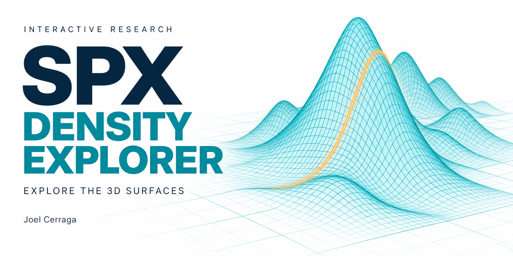

# SPX Option-Implied Density Research

A reproducible investigation of risk-neutral distributions inferred from SPX option prices, by **Joel Cerraga**.

**[Research landing page](https://joelcerraga.github.io/SPX-Density-Research/)** · **[Interactive graph gallery](https://joelcerraga.github.io/SPX-Density-Research/explorers/)** · **[Final paper](SPX%20Density%20Research/paper/SPX-Option-Implied-Density-Final-Paper.pdf?v=208db74854f9)**



## Research at a glance

- Ten analytical notebooks, progressing from a known synthetic benchmark to constrained multi-maturity estimation and empirical comparisons.
- Four self-contained interactive explorers, with 3D surfaces and linked density slices.
- A final comparison of three observed SPXW snapshots on two dates, with three expiries per snapshot.
- All 5,518 retained option prices fall within their original spreads in the three primary 240-bin fits, at the declared counting tolerance of 10⁻⁷ index points.

Price compatibility is imposed during fitting. It does not establish density accuracy or forecasting performance. Held-out spread misses, a numerically unresolved validation fold and broad conditional tail ranges remain part of the findings. These are risk-neutral valuation distributions, not physical probability forecasts.

## Read and reproduce

The complete research project is in **[`SPX Density Research/`](SPX%20Density%20Research/)**. Start with its [research README](SPX%20Density%20Research/README.md) for Python setup, experiment commands and milestone history.

- [Final PDF — author-supplied Version 1.1, 88 pages](SPX%20Density%20Research/paper/SPX-Option-Implied-Density-Final-Paper.pdf?v=208db74854f9) and [earlier editable Word source — Version 1.0](SPX%20Density%20Research/paper/SPX-Option-Implied-Density-Final-Paper.docx).
- [First notebook](SPX%20Density%20Research/01_synthetic_density.ipynb) and [final empirical comparison](SPX%20Density%20Research/10_empirical_comparison.ipynb).
- [Final comparison methodology](SPX%20Density%20Research/research/comparison_methodology.md).
- [Development decisions, setbacks and lessons](SPX%20Density%20Research/research/development_reflection.md).

The four original HTML explorers remain at their existing paths in [`SPX Density Research/interactive/`](SPX%20Density%20Research/interactive/). Downloaded copies include their plotting code and data; their 3D panels require WebGL support.

## Website maintenance

The website is static HTML, CSS and JavaScript. Python 3.11+ is sufficient to rebuild and verify it; no website packages, external fonts or analytics are required.

```bash
python scripts/build_site.py
python scripts/verify_site.py
python -m http.server 8000
```

Open `http://localhost:8000/` in your browser to preview locally. GitHub Pages publishes the checked-in root `index.html`; `explorers/index.html` provides the separate graph gallery.

Edit page content in `scripts/build_site.py`, the shared styling in `assets/site.css`, and navigation behaviour in `assets/site.js`. Previews link directly to the saved scientific figures. The builder never rewrites the research archive.

View the [published-page preview](assets/previews/landing-page.jpg). See the [website development record](docs/website-milestone.md) for the design decisions and validation scope.
