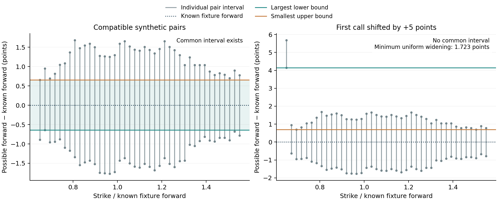
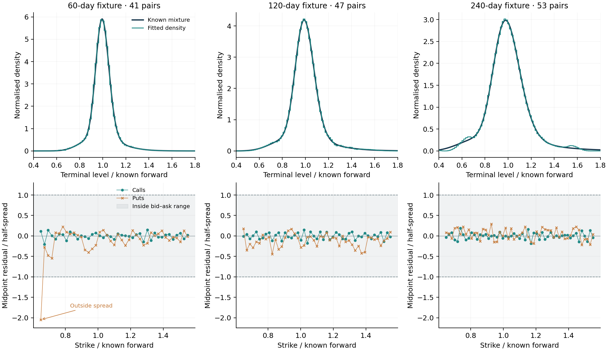

# Notebook 9, Part A: preparing the empirical calibration

**Synthetic preparation record, retained alongside the subsequent empirical application.** All fitted results in Part A are synthetic acceptance exercises. The supplied marking-price files subsequently enabled the first market case in [Part B](marking_methodology.md), which uses an explicitly separate exchange-BBO and quote-implied-carry profile. Notebook 10 and final-paper assembly remain on the [roadmap](project_roadmap.md).

## 1. A usable numerical method still needs usable observations

As Bahra explains in his Bank of England paper [1], an option-implied density is a risk-neutral valuation distribution. Its empirical interpretation depends on the option observations and assumptions supplied to the estimator. Earlier notebooks validated the numerical method on known examples and showed why plausible prices or a smooth surface do not establish correct tail recovery. This notebook addresses the next link: what information must be verified before observations can be passed to that method?

The original candidate remains useful as an audit example. Its 27,782 records, zero size fields and incomplete quote-time interpretation have not been reclassified as accepted observations. The candidate file remains unchanged. The initial access assessment below preceded the supplied marking-price files; Part B records their later assessment and different supported profile.

**Table 22. Initial source assessment before the supplied marking-price files.** Product descriptions establish possible routes, not actual access or approval of unseen files.

| Source | Evidence available in this project | Decision for this stage |
|---|---|---|
| Original Cboe page candidate [2] | Archived payload and audit; quote observation datetime/timezone and zero-size meaning remain unresolved | Retain for the data audit; no density fit |
| Cboe Option EOD Summary [18] | Primary layout documentation; advertised sample request returned HTTP 403 | No sample contents inspected; access attempt recorded |
| HistoricalData.net public 2022 sample [19] | Vendor documentation describes asynchronous last-standing quotes; quote timestamps start in August 2026 | Not downloaded: the advertised sample does not meet this study's synchronised-input requirement |
| Institutional OptionMetrics route [20] | WRDS describes option quotes and curve data; no export or institutional access has been supplied | Possible route requiring an actual authorised export and its documentation |

These findings are specific to the accessed material. They do not establish that every public or commercial source is unsuitable. The failed sample request is archived in `data/raw/cboe_eod_sample/retrieval.json`; the other access observations and links are in [data_access_status.md](data_access_status.md). No purchase or account access was undertaken.

## 2. A traceable input bundle

The [empirical input guide](empirical_input_guide.md) specifies three files: a quote CSV, a discount CSV and a manifest recording the source evidence, conventions and checksums. Empty templates are supplied, together with a separately labelled synthetic example. The first application uses one observation instant, one class, European cash settlement and two or more distinct settlement horizons. It excludes duplicate quotes, unusable sizes, nonpositive or crossed prices, and spreads greater than 25% of midpoint. Exclusion reasons and unmatched counterpart rows remain in the audit.

Complete timestamps include a UTC offset. The code checks whether all quotes belong to the same observation instant, whether settlement follows observation and whether different declarations conflict for an expiry. The elapsed UTC interval is converted to years using ACT/365F. A date-only expiry, file retrieval timestamp or underlying last trade cannot supply a missing quote observation time. Source review must also establish the timestamp's meaning; agreement among strings does not establish genuine synchronisation.

Discounts are keyed to the snapshot and settlement horizon, with observation and availability timestamps. A curve available only after the quote snapshot is rejected. Its maximum permitted age is declared explicitly; the fixture uses one day. A positive discount factor above one is allowed. The required source notes must explain the curve and any tenor conversion. These checks prevent an obvious timing inconsistency but do not establish that a chosen curve is economically appropriate.

The manifest's review record is attributable evidence for the research decision, not an automated certificate. In particular, a valid hash proves neither provenance nor permission. The actual export and documentation must be assessed before a market result is interpreted.

## 3. From matched call–put pairs to a conditional forward

As Aït-Sahalia and Lo discuss in their paper on state-price densities [10, §III.A, Equation (17)], European put–call parity links calls and puts at the same strike and maturity. Our Equation (7) states that relationship, and Equation (8) rearranges it into bid–ask bounds. These bounds condition on the supplied discount factor and matching contract/observation information.

Write the lower and upper bounds from pair $i$ at horizon $m$ as $\ell^F_{mi}$ and $u^F_{mi}$. To use all retained pairs consistently, define

$$
\underline F_m=\max_i\ell^F_{mi},\qquad
\overline F_m=\min_i u^F_{mi},\qquad
\widehat F_m=\frac{\underline F_m+\overline F_m}{2}
\quad\text{when }0<\underline F_m\leq\overline F_m.
\tag{34}
$$

Equation (34) is this project's intersection rule and midpoint convention, derived from Equation (8); it is not a new formula attributed to the paper. The interval is a **conditional compatibility set**, not a statistical confidence interval. Choosing its midpoint is a declared point-input rule, not proof that the midpoint is the true forward or the best estimate under a noise model. No probability distribution for that uncertainty is supplied here.

If the intersection is empty, the code stops before density fitting. A useful diagnostic is the smallest common amount by which all pair intervals would need to be widened on both sides:

$$
s_m^*=\min\{s\geq0:\max_i(\ell^F_{mi}-s)
             \leq\min_i(u^F_{mi}+s)\}
       =\frac{(\underline F_m-\overline F_m)_+}{2}.
\tag{35}
$$

The equality follows because intersection after widening requires $\underline F_m-s\leq\overline F_m+s$. The quantity is in **forward index points**, not a modification to each option quote or an estimate of transaction costs. It is reported without applying the widening. Discarding the binding pair to obtain a convenient forward would change the sample based on the desired answer; that is not done.

**Figure 24. Conditional forward bounds for the first synthetic horizon.** Each vertical segment is one call–put pair's interval from Equation (8). The left panel has a common intersection. The right panel adds five points to the first call's bid and ask while leaving the put unchanged; the largest lower bound then exceeds the smallest upper bound. The dotted line is the known fixture forward, available only because this example is synthetic. The shaded compatible band is not a confidence interval.

The altered quote still has a positive, ordered bid/ask pair and positive sizes. Its rejection therefore demonstrates a cross-strike compatibility check that ordinary row screening cannot supply. Equation (35) gives a required uniform widening of **{{PARITY_RELAXATION}} forward points**. That figure is diagnostic only: the inconsistent case is not calibrated.

## 4. Forward estimation belongs inside model selection

As Cawley and Talbot explain in their model-selection paper [17, §§2.1, 5.1], selecting a tuning parameter is part of the procedure whose performance must be assessed. A further dependency arises here: the forward itself is estimated from quotes. Computing it once from all pairs before cross-validation would let held-out observations influence their own predictions.

The implemented rule holds out a **whole call–put pair** at each selected strike. For each fold, Equation (34) is recomputed from that fold's training pairs only. These training forwards enter the mean constraints, physical density support and residual scaling. Thus the score becomes

$$
\operatorname{CV}_{F}(\lambda)=
\frac{\displaystyle\sum_{k,m}\sum_{i\in\mathcal H_{km}}
\left[\frac{\widehat C_{m,\lambda}^{(-k)}(K_{mi};\widehat F_m^{(-k)})
                 -C^{\mathrm{mid}}_{mi}}{\widehat F_m^{(-k)}}\right]^2}
{\displaystyle\sum_{k,m}|\mathcal H_{km}|},
\qquad \widehat\lambda=\arg\min_{\lambda\in\Lambda}\operatorname{CV}_{F}(\lambda).
\tag{36}
$$

Here $\mathcal H_{km}$ contains held-out pair positions and $\widehat F_m^{(-k)}$ comes exclusively from their complement. This is our application of the separation principle, not an equation copied from [17]. Discounts remain externally supplied inputs and must have been available at the observation. Each expiry can contain a different number of pairs. The three folds interlace interior strikes; both endpoint pairs remain in training. Scores are pooled by the number of evaluated call prices. Exact score ties choose the larger coefficient.

The declared candidate set remains $\Lambda=\{10^{-7},10^{-6},10^{-5}\}$, with 120 common normalised bins on $[0.3,2.2]$. The selected coefficient is refitted using all accepted pairs and their full-data forward intersection. Call midpoints enter the objective. Puts supply parity information and separate residual diagnostics; they are not counted again as independent call observations.

The joint estimator remains the quadratic programme in Equation (17), using the explicit-residual Clarabel formulation described through Goulart and Chen [15]. The normalised calendar restriction follows the assumptions discussed by Gatheral and Jacquier [12]. Its numerical verification uses the analytical within-bin minimum checks from Notebook 5. Passing those checks applies to the fitted discrete horizons under that model, not arbitrary interpolation in observation date or maturity.

This CV score measures fixed-design interior-price interpolation. Endpoints are never held out; it is not an extrapolation score, density-loss selector, historical backtest or unbiased estimate of empirical predictive performance. The lowest candidate can win without locating an optimum beyond the declared grid. These limitations are retained from Notebook 8.

## 5. End-to-end synthetic acceptance exercise

The fixture contains 282 quote rows: 41, 47 and 53 call–put pairs across three nominal horizons. Prices come from the existing two-lognormal mixture, with the constant synthetic rate and dividend inputs. Each analytical price receives a half-spread equal to the smaller of 0.75 points and 8% of that price. Its midpoint is shifted by at most one-fifth of that half-spread, using the saved PCG64 stream with seed `(20260921, 9)`. Thus the clean price remains inside its quoted spread. This construction is a test fixture, not a calibrated microstructure model.

Dates, sizes and quote identifiers are invented. They test the declared input structure and UTC-offset arithmetic; they do not assert actual listed SPXW contracts or exchange opening days. The nominal day labels are convenient fixture names. The exact elapsed horizons used in valuation appear in Table 23, including the offset change between January and the synthetic settlement datetimes.

**Table 23. Verified synthetic input pairs and full-data forward inference.** Interval endpoints, forward estimates and forward errors are in index points. Known forwards are available only for the fixture.

{{FORWARD_TABLE}}

All 282 rows pass the declared screens. The three candidate scores from Equation (36) are **{{SCORES}}**. The selected value is $10^{-7}$, the lower boundary of this small grid. No larger candidate search is performed after inspecting the results. Nine training fits and one selected refit give ten joint fits; this is one functional validation example, not a repeated statistical comparison with Notebook 8.

{{NUMERICAL_SUMMARY}}

After fitting, the mixture's analytical prices are evaluated at the 138 midpoints between the input strikes, separate from the 141 quoted strikes. These clean prices and the known density are used only for the fixture's subsequent evaluation. Full-domain density errors include the benchmark mass outside the fitted support, as in Equation (23). This verifies a complete route from files to measured recovery error without relabelling the result as empirical evidence.

## 6. Check prices against the supplied spreads

A parity-compatible set can still be difficult to approximate with one constrained, smoothed price curve. For either option type $o$, define its distance outside the quoted interval as

$$
d^{\mathrm{spread}}_{mi,o}
=\max\{B_{mi,o}-\widehat V_{mi,o},\,
          \widehat V_{mi,o}-A_{mi,o},\,0\}.
\tag{37}
$$

This is a project diagnostic in index points, not a statistical test. Call values come from exact bin-payoff integration, Equation (11); put values follow Equation (7) using the same fitted forward and discount. A positive distance greater than $10^{-7}$ points is counted as outside. The calculation checks all retained calls and puts even though only call midpoints enter the price objective.

**Table 24. Independent fixture recovery and in-sample spread diagnostics.** The clean-price column uses separate strike midpoints. The spread columns assess the supplied input quotes; the two roles should not be conflated.

{{FIT_TABLE}}

**Figure 25. Density recovery and quote-range checks in the synthetic fixture.** The upper panels compare the fitted histogram with the known mixture in fixed reference-forward coordinates. Only $0.4$–$1.8$ is displayed; Table 24's density error covers the full positive domain. The lower panels divide midpoint residuals by each quote's half-spread: values between $-1$ and $1$ lie inside the bid/ask interval. Both option types are shown. Half-spreads are positive in this fixture; the stored point-distance diagnostic also works for a valid zero-width quote.

One quote in the first horizon lies approximately **0.01993 index points** outside its range. The result is retained. It does not contradict parity feasibility: pairwise compatibility with a forward does not assert that the regularised density will price all pairs inside their spreads. The existing objective uses midpoint residuals, not bid/ask constraints. Nor does the result prove that a fit satisfying every spread is impossible. Such a feasibility question would require an additional constrained problem. As Notebook 8 already showed, a small price error and a satisfactory density error are also different targets.

## 7. Deliberately invalid inputs and development lessons

**Table 25. Input-failure exercises applied to the saved fixture.** These are designed checks, not failures discovered in market observations. Mutations and returned reasons are retained in `results/empirical_preparation.json`.

{{CHECK_TABLE}}

Additional unit checks alter held-out prices while keeping their training pairs unchanged, then verify that the corresponding training forward and predictions are unchanged. Saved CV scores are reconstructed from the archived weights and training-only forwards. The constraints of all ten fits are checked independently, and all eight earlier notebooks plus both 3D companions are matched against their Milestone 8 checksums.

The principal setbacks at this stage were unavailable sample access and unsuitable metadata in another advertised sample. They were not resolved by a successful solver run. The useful response was to make the missing empirical requirements explicit and implement the parts that could be validated with known inputs. During that implementation, the quote-derived forward dependency was identified and included within each fold. The remaining spread residual illustrates why input compatibility, numerical convergence and quote reproduction require separate evidence.

The [development reflection](development_reflection.md) records these preparation-stage observations alongside the earlier notebooks. [Part B](marking_methodology.md) subsequently assesses the supplied files, explains its separate quote-implied-carry profile and reports the first empirical calibration with the remaining fit limitations. Notebook 10 will compare the reserved observations; the existing offline maturity explorers remain available.

## Sources and reproducibility

Full records and source-to-relationship mappings are in [references.md](references.md). Bahra [1] supplies the risk-neutral interpretation; Aït-Sahalia and Lo [10] supplies the parity foundation; Cawley and Talbot [17] supports separation of selection and evaluation; Gatheral and Jacquier [12] and Goulart and Chen [15] support the calendar and solver discussions. Equations (34)–(37), thresholds, fixture construction and numerical results are explicitly this project's definitions and calculations. Provider sources [18]–[20] establish operational documentation only.

Run `python build_milestone9_notebook.py` from the project folder to regenerate the fixture, execute the calibration exercise, rebuild figures and tables and write the explanatory notebook. `run_market_calibration.py` is the separate entry point for a reviewed bundle; it does not fetch data. The [input guide](empirical_input_guide.md) includes the format and command. Numerical evidence, source checksums, fixture hashes, row-level audit, fold membership, training forwards, solver histories and fitted probabilities are retained in `results/empirical_preparation.json`.
