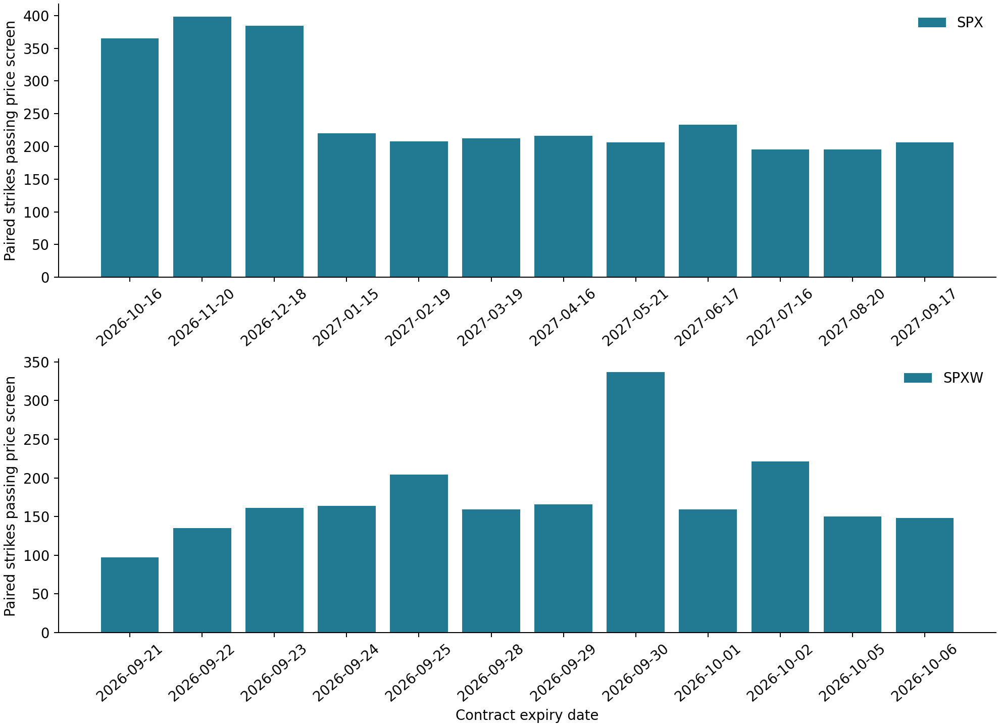
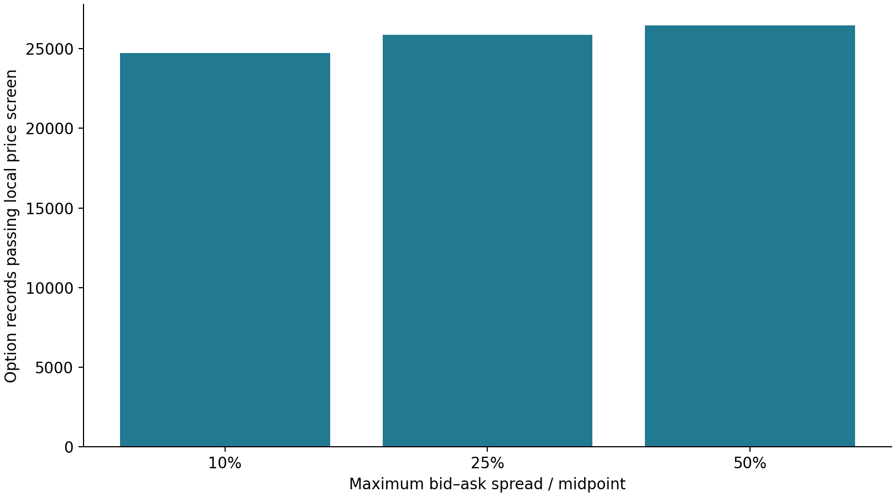

# From theoretical prices to observed option quotes
## Milestone 2: source assessment and candidate-data audit
Joel Cerraga | Quant research project | 19 September 2026

**Status:** a candidate SPX quote snapshot has been retrieved and audited. Its observation time and quote-size reliability remain unresolved. It is not approved for density estimation. Figures 5–6 describe this candidate snapshot, not a validated market-implied distribution.

### Purpose and approach
The first experiment established that a known density could be recovered from theoretical call prices. The subsequent task involved identifying whether an accessible source could provide suitable observed prices. This distinction is necessary because numerical accuracy on synthetic data does not establish the quality of market inputs.

The candidate was extracted from the embedded `CTX.contextOptionsData` object on Cboe's public SPX delayed-quotes page [2]. The raw JSON is preserved alongside a SHA-256 checksum and retrieval metadata. This is a one-off retrieved page payload, not a documented or guaranteed API. The quote audit can be rerun offline without contacting the source.

### Source assessment
Table 2. Source assessment and access status.

| Source | Evidence obtained | Decision |
|---|---|---|
| Cboe public SPX delayed-quotes page [2] | Embedded option records retrieved; time-only timestamp; zero sizes throughout | Audit candidate only |
| Cboe DataShop Option Quotes [3] | Documented bid/ask snapshots, contract identifiers and quote datetime | Structured fallback; no purchase made |
| DataShop downloadable sample [3] | Download attempt returned HTTP 403 | Sample contents not inspected |

According to Cboe’s DataShop specification [4], `quote_datetime` records the interval timestamp in US Eastern time. Its field definitions provide a useful reference for the input schema. They do not establish the meaning or timezone of the different public-page timestamp. Availability of the paid product does not mean that it has been obtained for this project.

### Observation time and settlement
The public payload contains `timestamp = 17:43:22`, but no accompanying date or timezone. Its underlying last-trade field reports `2026-09-18T16:14:59`; this describes a trade and is not substituted for the quote observation time. Similarly, the UTC retrieval time describes collection, not the age of the quotes.

Contract expiry dates are decoded from the identifiers, with SPX and SPXW retained as separate roots. Root alone is not used to invent a settlement datetime. As Cboe specifies in its SPX contract documentation [5], SPX and SPXW have different expiration trading schedules. Before calibration, the applicable settlement convention, holiday schedule and full observation time must be confirmed. No time-to-expiry or expiry-based filtering is calculated in this audit.

### Price-screening methodology
For this audit, we define the midpoint as the arithmetic average of an ordered, finite bid and ask. Equation (5) is a descriptive definition, not a pricing theorem:

$$M_i=\frac{B_i+A_i}{2}.\tag{5}$$

Equation (5) supplies a representative quote value; it is not an observed execution price. To compare spreads across price levels, Equation (6) expresses their width relative to the midpoint:

$$R_i=\frac{A_i-B_i}{M_i}.\tag{6}$$

The local screen excludes invalid contract identifiers, nonpositive strikes, duplicate symbols, missing or nonfinite prices, negative bids, nonpositive asks, crossed markets, zero bids and relative spreads above a chosen threshold. All rows are retained in the audit file with reasons. Exclusion counts can overlap. Duplicate records are flagged rather than averaged or silently overwritten.

A threshold of 25% is used provisionally, with 10% and 50% alternatives. These are research choices, not exchange rules or evidence of optimality. Quote-size problems are recorded as warnings and block interpretation of the snapshot as confirmed liquidity. Volume and open interest are not treated as substitutes for a current quote. A row passing this screen is only eligible for further investigation.

### Candidate-data results
Table 3. Candidate-snapshot audit results.

| Measure | Result |
|---|---:|
| Retrieved option records | 27,782 |
| Root-and-expiry groups | 61 |
| Records passing the 25% local price screen | 25,866 |
| Records excluded for wide relative spread | 1,916 |
| Zero-bid records, overlapping the spread exclusions | 697 |
| Records reporting zero bid size | 27,782 |
| Records reporting zero ask size | 27,782 |

All sizes were zero in this retrieved payload. It is not established whether this reflects unavailable fields, snapshot handling or actual quote sizes. No conclusion about market liquidity is drawn from those zeros.

Figure 5. Number of strikes with both a call and a put passing the provisional 25% price screen, for the first twelve listed expiry dates within each root. The panels retain SPX and SPXW separately. Dates are contract expiry labels, not verified settlement horizons. Counts do not establish continuous strike coverage or quote usability.

As shown in Figure 5, the audit identifies matched call–put observations for subsequent forward-consistency analysis. This does not yet determine whether the price curves satisfy no-arbitrage conditions.

Figure 6. Records passing the local price screen when the maximum spread-to-midpoint ratio is set to 10%, 25% and 50%. Counts are 24,721, 25,866 and 26,475, respectively. These are candidate-data diagnostics; the observation-time and size limitations apply at every threshold.

### Why paired calls and puts matter
As Aït-Sahalia and Lo (1998) explain in their *Journal of Finance* study [10, §III.A], matched call and put prices can be used to infer the forward through put–call parity. Rewriting their Equation (17) in our notation, for European contracts with matching settlement and deterministic discounting, gives Equation (7):

$$C(K,T)-P(K,T)=D(T)\,[F(T)-K],\qquad D(T)=e^{-rT}.\tag{7}$$

Equation (7) follows by subtracting the terminal put payoff from the call payoff: the difference is $S_T-K$. With a supplied discount factor, bid–ask quotes therefore imply the following indicative forward interval:

$$K+\frac{C_{\mathrm{bid}}-P_{\mathrm{ask}}}{D(T)}\leq F(T)\leq K+\frac{C_{\mathrm{ask}}-P_{\mathrm{bid}}}{D(T)}.\tag{8}$$

Equation (8) is our algebraic extension of the parity relationship in [10] to bid–ask intervals: the lowest call-minus-put value uses the call bid and put ask, and the highest uses the call ask and put bid. It will allow consistency across strikes to be assessed without assuming that every midpoint is exact. It requires contemporaneous, reliable quotes and matching contracts. No empirical forward is estimated here because those prerequisites have not been established. The parity relationship is established theory; only the notation and interval rearrangement are developed here. This stage implements the quote audit only.

### Required input fields
Table 4. Required fields and current treatment.

| Field | Meaning and treatment |
|---|---|
| Raw contract symbol | Preserved identifier; decoded root, expiry date, type and strike |
| Bid and ask | Index-point premiums; finite and ordered |
| Bid and ask sizes | Preserved in raw JSON; missing or nonpositive values flagged |
| Full quote observation datetime | Required before estimation; currently unresolved |
| Quote timezone | Required and explicit; currently unresolved |
| Settlement convention and datetime | Confirm for selected contracts before calculating maturity |
| Retrieval time and source | Provenance only; not substitutes for observation time |
| Discount factor and forward | Establish and document separately for each horizon |

### Next decision
The next empirical step is to obtain or verify a snapshot with a full observation timestamp and interpretable quote fields. Aït-Sahalia and Duarte (2003), in *Nonparametric option pricing under shape restrictions*, explain why a fitted call-price curve should be decreasing and convex in strike [9, §2]. Their study motivates our next step: select one adequately covered expiry, establish its discount factor and forward, and fit a constrained curve before applying Equation (3). Simply taking second differences of the present midpoints would bypass unresolved data problems.

The package contains a private research copy of the candidate payload. Before a public GitHub release, establish source redistribution rights or omit raw and row-level data and provide acquisition instructions. No repository or data has been published.

### References

[1] B. Bahra (1997), “Implied risk-neutral probability density functions from option prices: theory and application,” Bank of England, Working Paper No. 66. Sections 2.1–2.2 and Mathematical appendix. [Full paper](https://www.bankofengland.co.uk/-/media/boe/files/working-paper/1997/implied-risk-neutral-probability-density-functions-from-option-prices.pdf).

[2] Cboe, “SPX delayed quotes.” Retrieved 19 September 2026. [Source page](https://www.cboe.com/delayed_quotes/spx/quote_table). Primary data source; not a research paper.

[3] Cboe DataShop, “Option Quotes.” Accessed 19 September 2026. [Product documentation](https://datashop.cboe.com/option-quote-intervals).

[4] Cboe DataShop, “Option Quotes Specification,” v1.1, pp. 1–2. [File specification](https://datashop.cboe.com/documents/Option_Quotes_Layout.pdf).

[5] Cboe, “S&P 500 Index Options Product Specifications.” Accessed 19 September 2026. [Contract specifications](https://www.cboe.com/tradable-products/sp-500/spx-options/spx-specifications).

[9] Y. Aït-Sahalia and J. Duarte (2003), “Nonparametric option pricing under shape restrictions,” *Journal of Econometrics*, vol. 116, nos. 1–2, pp. 9–47. Section 2. [doi:10.1016/S0304-4076(03)00102-7](https://doi.org/10.1016/S0304-4076(03)00102-7); [author-hosted paper](https://www.princeton.edu/~yacine/cnvx.pdf).

[10] Y. Aït-Sahalia and A. W. Lo (1998), “Nonparametric Estimation of State-Price Densities Implicit in Financial Asset Prices,” *The Journal of Finance*, vol. 53, no. 2, pp. 499–547. Sections I and III.A, especially Equations (16)–(17). [Author-hosted paper](https://www.princeton.edu/~yacine/aslo.pdf).
