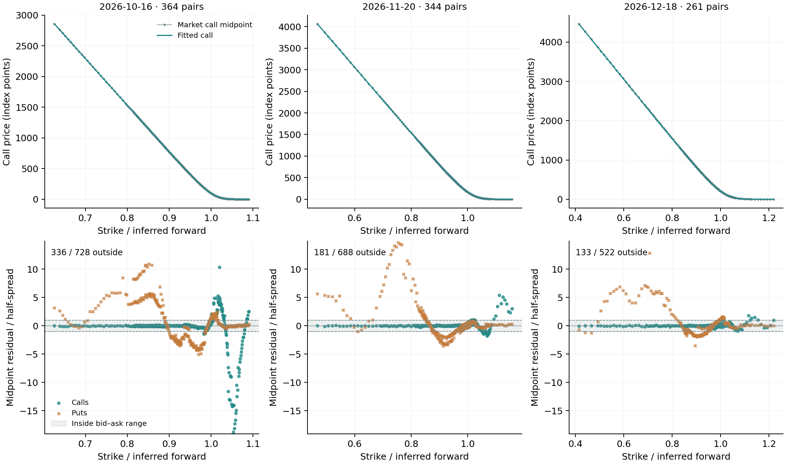
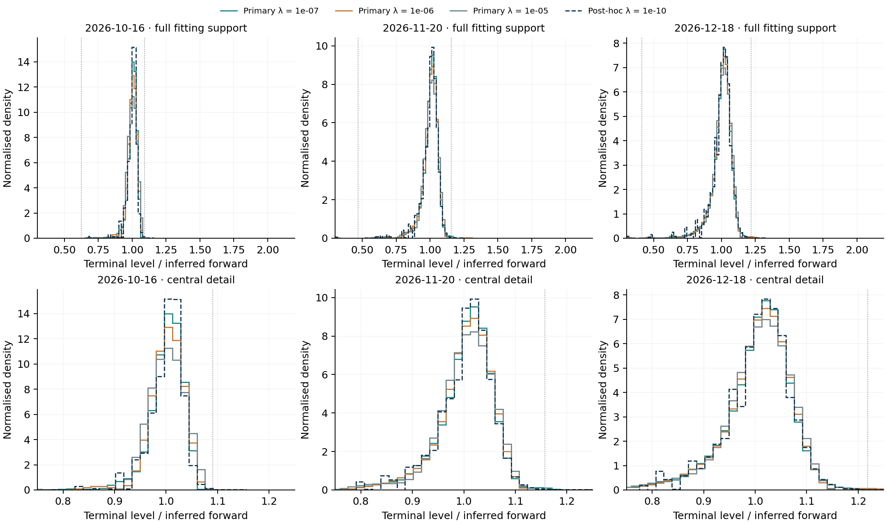
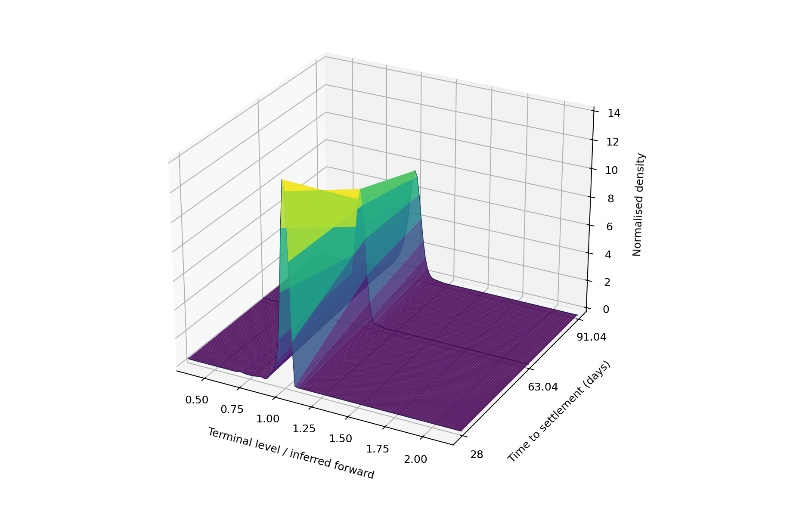

# Notebook 9, Part B: the first empirical SPX calibration

**Status: first empirical case completed, with material fit and tail limitations retained.** The three supplied CSVs are adequate for this explicitly defined exchange-BBO study. They provide two observation dates, not three: 31 August and 18 September 2026. The latter has two intraday snapshots. Part A remains a synthetic preparation exercise; the results below use observed market-price columns. Notebook 10 will use the reserved observations for comparison after addressing the limitations identified here. The combined paper remains a separate assembly stage.

## 8. What the supplied files establish

Cboe's marking-price documentation [21] distinguishes indicative marks from actual exchange BBO and states that both are included in its CSVs. Accordingly, this application reads `call_last_disseminated_market_bid/ask` and their put equivalents. It does not use the final indicative prices. The archived inputs match the three publicly linked Cboe downloads byte-for-byte; the HTTP results, byte counts and SHA-256 values are recorded in `data/raw/marking_prices/source_verification.json`. The snapshot labels come from the linked products, and the dates agree with every SPX-family message in each file. These observations establish the source-specific interpretation used here, rather than retroactively accepting the earlier candidate JSON.

**Table 26. Supplied file coverage and assigned role.** Each target row contains a call and put at one strike. Counts include all SPX/SPXW expiries before screening. CT means Chicago civil time; all three observation dates are on UTC−05:00.

{{INPUT_TABLE}}

The September 15:15 CT file is a later observation of the same day. Concatenating it with the 15:00 file would mix observation instants and double-count many contracts. The August file is a second date, sufficient for a small comparison, but two dates do not supply a historical time series or an event-study sample. Both reserved files are audited here and retained unchanged for Notebook 10.

All indicative bid/ask size entries in the SPX-family rows are `1`. These are **not demonstrated market depth** and do not satisfy the positive actual-size profile used in Part A. A separate adapter, `src/marking.py`, therefore records actual size as unavailable, uses the documented exchange BBO and makes no NBBO or executable-depth claim. The original external-curve/NBBO adapter remains unchanged. This is an explicit change of empirical profile based on new source evidence, not a relabelling of failed observations.

## 9. Contract scope, timing and screening

For the first case, the protocol fixes the 18 September 15:00 CT snapshot and the SPXW expiries **16 October, 20 November and 18 December 2026**. These give approximately one-, two- and three-month horizons while keeping a common PM settlement class. Other expiries are retained in the raw files and excluded with a scope reason. As Cboe's contract specifications and holiday schedule establish [5, 22], these are ordinary full-session SPXW dates; settlement is represented by 16:00 New York time. The October offset is UTC−04:00 and the later offsets are UTC−05:00. Elapsed UTC seconds divided by 365 days give 28, 63 + 1/24 and 91 + 1/24 days. The extra hour is the daylight-saving transition, not an extra market session.

The adapter verifies OSI root, expiry, option type and encoded strike against the row. It requires both sides of a matched pair to have finite positive, ordered prices and a full spread no greater than 25% of midpoint. Duplicates are excluded without averaging. A declared activity screen requires both message timestamps to be at most 60 seconds old and no later than the documented snapshot. Individual message times are last-update information within a snapshot; their inequality alone does not establish that the source lacks a common as-of book state. The activity screen is a research choice, not proof of execution availability.

No SPX-family row has an unresolved metadata failure in these files. The primary file contains 13,891 target pairs; 11,936 pass the price screen and 11,835 also pass the age screen across all target roots and expiries. The three selected SPXW expiries retain **364, 344 and 261 pairs**, respectively: **969 pairs and 1,938 individual option quotes**. All selected price-screened pairs pass the age screen. Every target row retains its screening and scope reasons in `results/marking_input_audit.json`; all non-target rows remain in the original CSVs.

## 10. Inferring discount and forward together

The CSVs do not supply a discount curve. As Aït-Sahalia and Lo explain through European put–call parity [10, §III.A], call and put prices link strike, discounting and the forward. Instead of inserting an unobserved rate, this application estimates a **quote-implied carry proxy**. With $H_m=D_mF_m$, Equation (7) becomes linear in the two unknowns:

$$
C_{mi}-P_{mi}=H_m-D_mK_{mi},\qquad
b^-_{mi}=C^{\mathrm{bid}}_{mi}-P^{\mathrm{ask}}_{mi},\qquad
b^+_{mi}=C^{\mathrm{ask}}_{mi}-P^{\mathrm{bid}}_{mi}.
\tag{38}
$$

Let $y_{mi}=C^{\mathrm{mid}}_{mi}-P^{\mathrm{mid}}_{mi}$ and let $K_{0m}$ be the median retained strike. Our point-input convention is equal-weight constrained least squares:

$$
(\widehat H_m,\widehat D_m)=
\underset{H,D}{\arg\min}\;\frac{1}{N_m}\sum_{i=1}^{N_m}
\left(\frac{H-DK_{mi}-y_{mi}}{K_{0m}}\right)^2,
\quad
\begin{cases}
b^-_{mi}\le H-DK_{mi}\le b^+_{mi},&\text{all retained }i,\\
D\ge\varepsilon_{\mathrm{carry}},\quad H\ge\varepsilon_{\mathrm{carry}} K_{0m},&\varepsilon_{\mathrm{carry}}=10^{-8},
\end{cases}
\quad\widehat F_m=\frac{\widehat H_m}{\widehat D_m}.
\tag{39}
$$

Equations (38)–(39) are this project's rearrangement and estimation rule, not a formula quoted from the paper. As Boyd and Vandenberghe describe in *Convex Optimization* [11], a convex quadratic objective with linear restrictions admits a quadratic-programme formulation. The implementation centres the strike coordinate and solves for $\beta_0=(H-DK_0)/K_0$ and $\beta_1=D$. An unconstrained least-squares solution is accepted only when it satisfies every restriction; otherwise the two-variable QP uses Clarabel with strict solved status [15]. An empty or unbounded discount-feasibility projection blocks calibration. In this primary sample, the unconstrained optima are already feasible.

Two linear programmes minimise and maximise $D$ over the same bid–ask set. Their interval is a **feasible projection**, not a confidence interval. The forward is then checked independently against the conditional interval in Equation (34), but is the regression-implied value from Equation (39), not that interval's midpoint. The interval's midpoint remains a diagnostic field inherited from the preparation routine and is not the market fit's chosen forward. A positive $D>1$ is allowed: an inferred negative rate is not rejected by fiat.

For interpretation only, a constant continuously compounded rate equivalent is

$$
\widehat r_m=-\frac{\log\widehat D_m}{T_m}.
\tag{40}
$$

Equation (40) is an algebraic transformation of the fitted discount. It is **not an independently observed risk-free rate**, a Treasury/OIS curve or evidence of a specific funding mechanism. Bid–ask effects and departures from the assumed common parity inputs can affect this estimate. No external curve sensitivity or joint statistical uncertainty is claimed in this stage.

**Table 27. Full-sample quote-implied carry inputs.** The discount intervals project all retained pair inequalities. Forward values are in index points; the last column is the equivalent annual rate, expressed as a percentage. Reporting digits aid reconstruction and do not imply this degree of economic precision.

{{CARRY_TABLE}}

## 11. Selection, joint calibration and observed spread misses

As Cawley and Talbot explain [17], evaluation must account for the complete selection procedure. Whole call–put pairs are therefore held out together in the three interlaced interior-strike folds. **Both discount and forward** are re-estimated from each fold's training pairs using Equation (39); held-out pairs cannot determine either input. The score is Equation (36) with the call predictor also conditioned on the training-only discount. Endpoints remain in training, so the 963 held-out predictions assess interpolation over observed interior strikes, not performance at unobserved tail strikes or future dates. This score is the tuning criterion and is not an independent final performance estimate.

The primary candidate grid remains $\{10^{-7},10^{-6},10^{-5}\}$, with the existing 120 equal-width bins on $S/F\in[0.3,2.2]$. There are nine training fits and three full-data refits; the selected refit is reused. As Goulart and Chen's solver paper describes [15], the explicit-residual conic formulation supports the quadratic objective without changing the pricing representation. The project retains its existing mass, mean and continuous calendar checks.

As Gatheral and Jacquier's calendar argument shows [12], ordering normalised call values across maturities depends on the carry model. Here deterministic carry and proportional dividends are **modelling assumptions** applied to inferred inputs. The index's actual cash-dividend process is not reconstructed. Passing the implemented inequalities does not establish arbitrage freedom under every real-market funding/dividend specification, nor does it establish an interpolated maturity model.

The primary grid selects its weakest coefficient, **$\lambda=10^{-7}$**. Its fitted calls closely overlap observed midpoints on the price scale, yet **650 of 1,938 call/put values are outside their bid–ask ranges** at a $10^{-7}$-point counting tolerance. The largest miss is approximately **1.8661 index points**. These are in-sample residuals, with no spread constraint imposed by the objective. Parity feasibility asserts that each pair can accommodate the inferred line; it does not guarantee that the particular regularised call curve also satisfies both quoted intervals.

**Table 28. Primary selected fit and quote coverage.** RMSE uses retained midpoints. The outside counts separate calls and puts; each has the pair count in Table 27. A low price RMSE does not certify a recovered density.

{{MARKET_FIT_TABLE}}

**Figure 26. Primary market fit and bid–ask residuals on 18 September 2026.** Upper panels show market call midpoints and the selected fitted call curve. Lower panels show both option types in units of their own half-spread. The shaded band is the bid–ask interval. The common vertical range covers every residual; misses are retained rather than clipped. Prices are index points, not dollars per contract. All retained spreads in this case have positive width.

The lower panels demonstrate why a visually close price curve is insufficient evidence of quote reproduction. Put values follow the fitted call and Equation (38), whereas the loss function targets call midpoints. The narrower put spreads can make modest point residuals large in half-spread units. No quotes are shifted, no forward is reselected to conceal the misses and no density-recovery error is reported against an invented market truth.

## 12. A boundary choice prompted a separate diagnostic

The weakest primary candidate won while numerous prices missed their spreads. This observed result motivated an explicitly **post-hoc** lower grid, $\{10^{-10},10^{-9},10^{-8}\}$, using the same folds, support, carry rule and solver criteria. Its nine training fits and three full-data fits are saved separately in `results/marking_range_diagnostic.json`, with the primary-result checksum. It does not replace the primary protocol, and reusing the data after inspecting results supplies no independent validation.

**Table 29. Declared primary grid and subsequent lower-penalty diagnostic.** Scores pool held-out call errors divided by training forwards. The outside-spread and maximum-miss columns instead describe full-data refits, so they need not rank coefficients in the same order.

{{SENSITIVITY_TABLE}}

The diagnostic selects $10^{-10}$, again at its lower boundary. Its score is approximately **60% below** the primary grid's selected score, but **501 prices still miss their spreads: three calls and 498 puts**. The $10^{-9}$ fit has fewer total misses, 496, while a slightly worse call-price score. Thus choosing a coefficient to predict call midpoints is not equivalent to choosing it to satisfy both sides' quoted intervals. The tested grid has not located an interior optimum, and these results do not establish that ever-weaker smoothing is desirable. A future comparison should predeclare any revised selection rule and assess a joint call/put or spread-feasibility formulation, not silently optimise the reported miss count.

**Figure 27. Market-density sensitivity to smoothing.** The three solid curves use the declared primary coefficients; the dashed curve uses the post-hoc selected $10^{-10}$. Top panels show the entire fitting support and lower panels enlarge $0.75\le S/F\le1.25$. Dotted vertical lines delimit the retained strike range. Curves are estimated histograms, not analytical benchmark densities. Tiny far-tail masses are easier to compare numerically in Table 30 than on this peak-dominated linear scale.

As Malz discusses in his research on option-based distributions [14, §§2.3 and 3.2], extrapolation deserves separate attention when interpreting tail summaries. Here the primary retained upper strikes are only about **1.0905F, 1.1571F and 1.2188F**. The $1.2F$ threshold exceeds observed coverage in the first two horizons, while $1.8F$ exceeds it in all three. Even when a threshold itself is covered, its upper-tail integral still extends beyond observed strikes. The $0.8F$ threshold falls within the retained range at all three horizons, but that alone does not identify the entire lower tail.

**Table 30. Conditional risk-neutral summaries for the primary and post-hoc selected fits.** Probabilities are percentages; variance is dimensionless. These are sensitivity outputs, not confidence intervals, physical forecasts or recommendations. Values near numerical resolution should not be read as precise market probabilities.

{{RISK_TABLE}}

The primary first-horizon $Q(S_T>1.8F)$ is about 0.009674%, versus about 0.000001186% in the weaker diagnostic fit. This difference is orders of magnitude despite the small absolute probabilities. It illustrates weakly determined extrapolation; it is not evidence that either figure is the correct probability. As Bahra emphasises in the Bank of England paper [1], the probability measure recovered from option valuation is risk-neutral, so these outputs are not direct real-world crash or rally forecasts.

## 13. Numerical evidence and the empirical 3D companion

{{NUMERICAL_SUMMARY}}

These checks cover the 12 primary fits plus the 12 diagnostic fits. The earlier synthetic acceptance exercise remains separate. Independent checks reconstruct the training carry, pooled scores, call/put residuals and risks from saved weights; test exact parity including $D>1$; exercise a bound-active QP and an incompatible parity set; and verify that indicative fields and held-out pair changes cannot alter the wrong inputs. One deliberately invalid single-row fixture initially exposed an empty timestamp-summary error. The adapter now retains an explicit metadata rejection with unavailable extrema instead of failing before it can report the problem. Valid market results are unchanged by that correction.

**Figure 28. The primary selected empirical density across three settlement horizons.** The surface connects bin centres and the three fitted maturity curves for visual guidance. It is not a fitted continuum of maturities. The horizontal terminal-level coordinate is normalised by each expiry's inferred forward; the vertical coordinate is its corresponding density. Exact steps and alternative smoothing choices are available in the [offline empirical explorer](../interactive/empirical_density_surface.html).

The explorer supports rotation, zoom, hover, coefficient selection, full-support/central views, a linked exact histogram and maturity play/pause. It carries the post-hoc labels and spread-miss counts with each choice. This is a maturity animation at one observation date, not the historical-date animation planned for Notebook 10. Both earlier synthetic explorers and all eight earlier notebooks remain unchanged, including the Figure 4 explanation below its figure and caption.

## 14. What is complete and what follows

Notebook 9 now contains its synthetic preparation and the first traceable empirical calibration. The dataset question is resolved for this scope: the supplied files support market-price estimation with inferred carry and explicit depth limitations. They also supply a reserved second date and a later same-day snapshot. They do not supply a long historical sample, independently observed discount inputs, a known terminal density or statistical uncertainty bands.

Notebook 10 is the remaining planned analytical notebook. It will examine empirical fit limitations and compare the reserved observations with consistent contract and horizon treatment, then provide date-aware interaction. The cross-date exercise must distinguish time passing towards a fixed expiry from a change in the same-horizon distribution. The combined paper follows, with the title page, abstract, contents, numbered lists, abbreviations and mathematical symbols already specified in the [paper registers](paper_registers.md).

The [development reflection](development_reflection.md) records the source-field distinction, missing curve workaround, training-only carry inference, smoothing-boundary finding, remaining put residuals and extrapolation sensitivity. Run `python build_milestone9_notebook.py` to recompute both parts, figures, tables and the offline companion entirely from archived inputs. `run_marking_calibration.py` and `run_marking_diagnostic.py` separately reproduce the empirical calculations. Theory references remain scholarly [1, 10–12, 14–15, 17]; Cboe [5, 21–22] supports provider and contract facts. Full bibliographic records are in [references.md](references.md).
